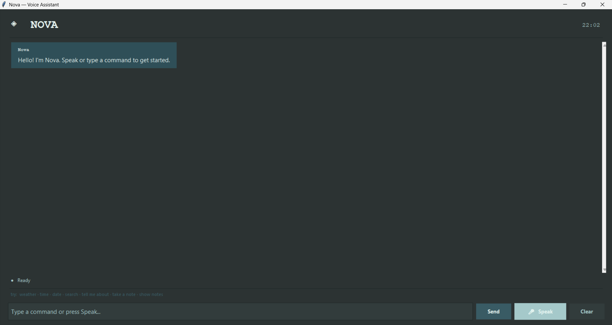
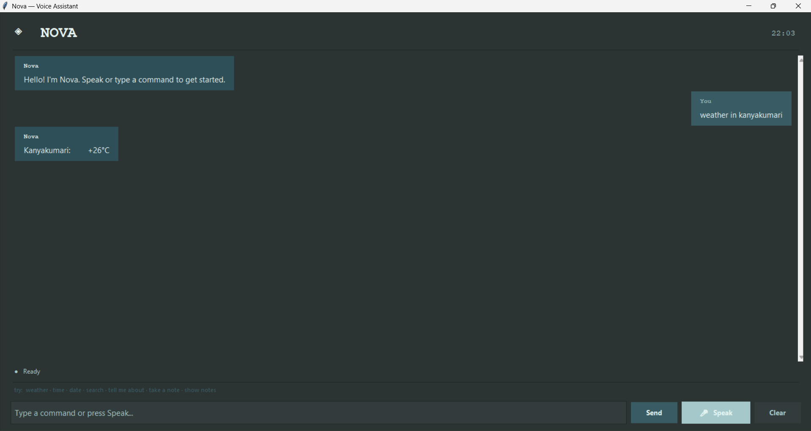
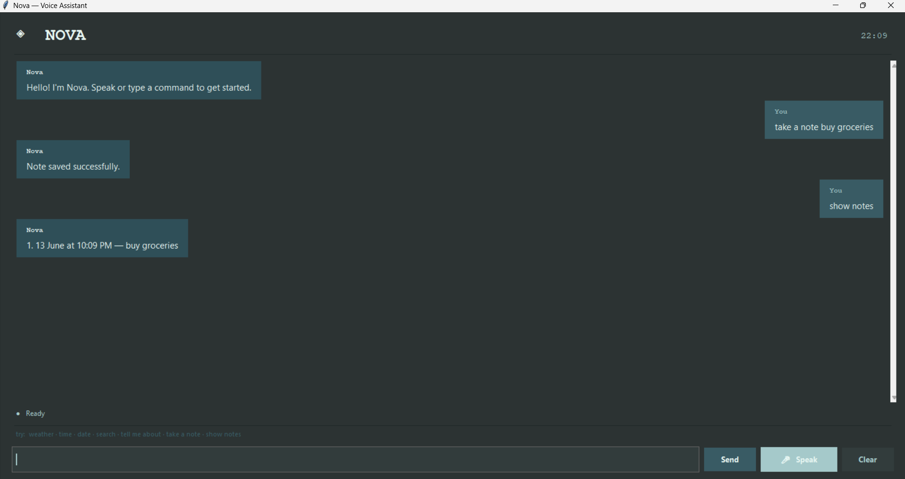
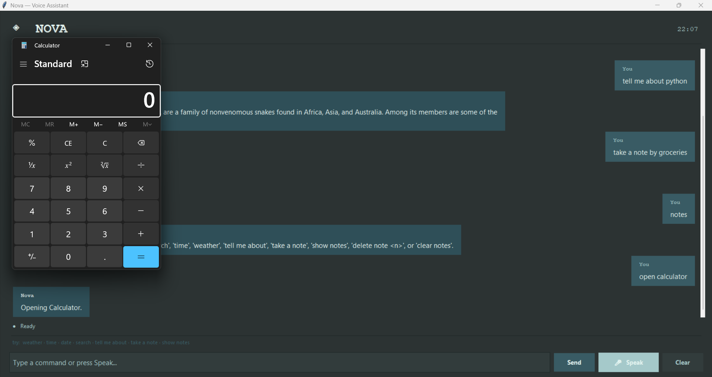
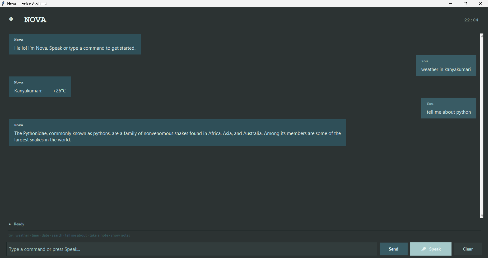
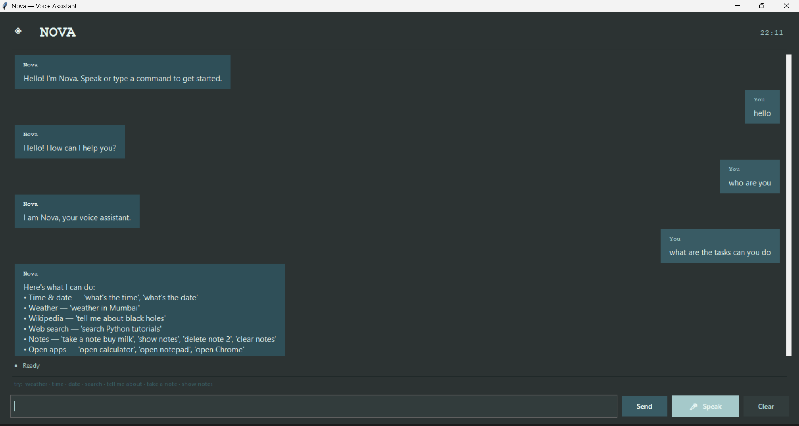

# Nova — Voice Assistant

A desktop voice assistant built with Python and tkinter.

---

## Features

- **Speech Recognition** — hands-free voice input via Google Speech API
- **Text-to-Speech Responses** — Nova speaks every reply aloud using pyttsx3
- **Weather Information** — live weather for any city via wttr.in
- **Notes Management** — take, view, delete, and clear persistent notes
- **Wikipedia Knowledge Search** — instant summaries with follow-up support
- **Web Search** — open browser searches directly from a command
- **Open Desktop Applications** — launch Calculator, Notepad, Chrome, and more
- **Modern Tkinter GUI** — chat-bubble interface with a live clock and status bar
- **Voice and Text Commands** — works with or without a microphone

---

## Screenshots

### Main Interface


### Weather


### Notes


### Open Applications


### Knowledge Search


### Full Conversation


---

## Prerequisites

### macOS
```bash
brew install portaudio
pip install -r requirements.txt
```

### Linux (Debian / Ubuntu)
```bash
sudo apt install python3-pyaudio portaudio19-dev
pip install -r requirements.txt
```

### Windows
```bash
pip install -r requirements.txt
```
PyAudio wheels are bundled for Windows — no extra step needed.

---

## Setup & Run

```bash
python main.py
```

Python 3.9+ required. An internet connection is needed for weather and Wikipedia features. A microphone is optional — text input works without one.

---

## Configuration

Edit `config.json` to set your default city for weather:

```json
{
  "default_city": "Mumbai"
}
```

---

## Commands

| Command | Example |
|---------|---------|
| Greetings | "Hello", "Hi" |
| Time / Date | "What's the time?", "What's the date?" |
| Web search | "Search Python tutorials" |
| Wikipedia | "Tell me about black holes" |
| Follow-up | "Tell me more" |
| Weather | "Weather in Mumbai", "Weather Chennai" |
| Take a note | "Take a note buy groceries" |
| Show notes | "Show notes" |
| Delete a note | "Delete note 2" |
| Clear all notes | "Clear all notes" |
| Open apps | "Open calculator", "Open notepad", "Open Chrome" |
| Exit | "Goodbye", "Exit" |

### Keyboard shortcut
**Ctrl + Shift + Space** — triggers the Speak (voice input) button without using the mouse.

---

## Notes

Notes are stored in `notes.json` next to `main.py` and persist across sessions.  
Logs are printed to the console; set the log level to `DEBUG` in `main.py` for verbose output.